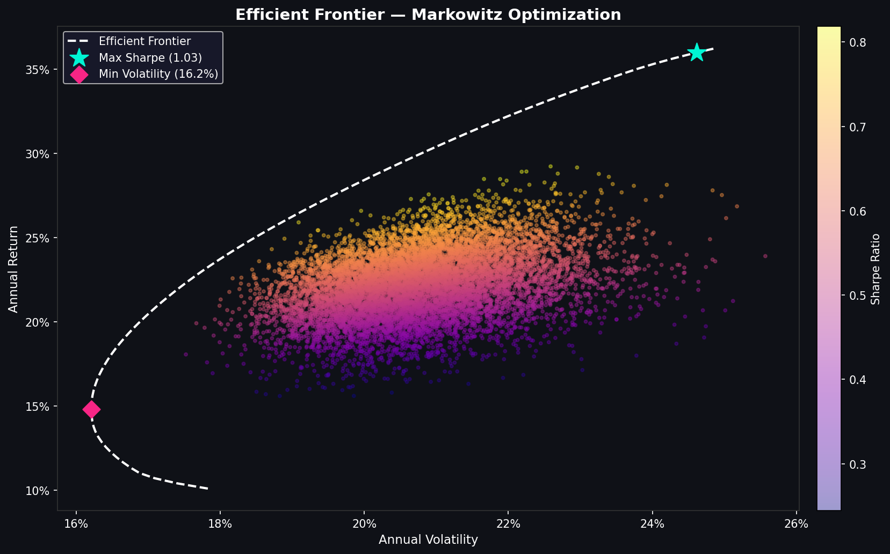
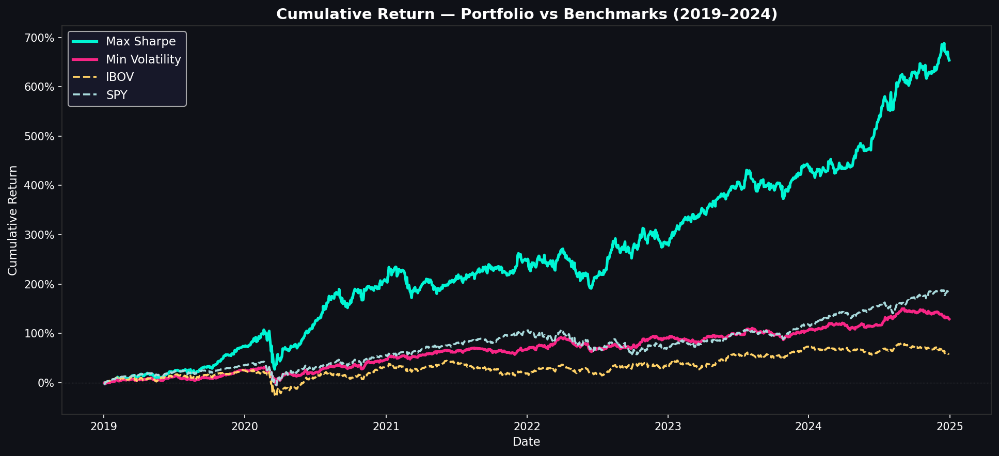
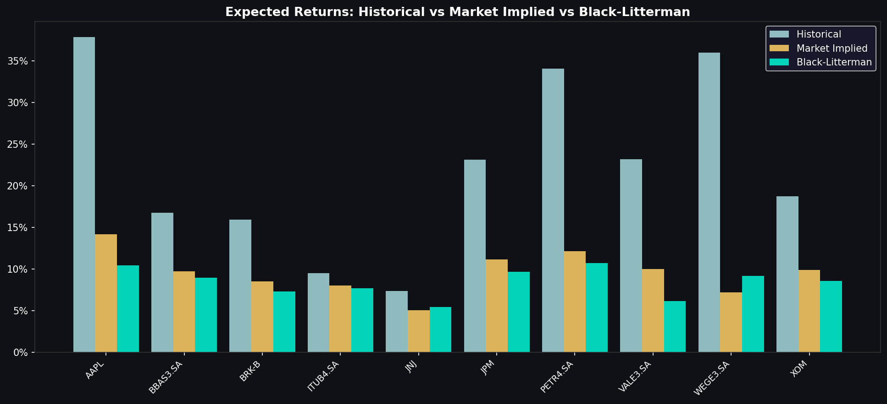

# Portfolio Optimization — Markowitz & Black-Litterman

A quantitative portfolio optimization project using **Mean-Variance Analysis** and the **Black-Litterman model**, applied to a mixed portfolio of Brazilian (B3) and U.S. equities over 2019–2024.

---

## Overview

This project implements the full pipeline of modern portfolio theory:

1. **Data Collection** — daily adjusted prices via `yfinance` for 10 assets across B3 and NYSE/NASDAQ
2. **Return Analysis** — annualized returns, covariance matrix, and correlation heatmap
3. **Efficient Frontier** — Monte Carlo simulation + analytical frontier via quadratic programming
4. **Benchmark Comparison** — risk-adjusted performance vs. IBOV and SPY
5. **Black-Litterman** — Bayesian model combining market equilibrium with analyst views

A full academic paper covering the mathematical foundations is available in [`paper.pdf`](paper.pdf).

---

## Results

### Efficient Frontier


### Portfolio vs Benchmarks


| Portfolio      | Annual Return | Volatility | Sharpe | Max Drawdown |
|----------------|--------------|------------|--------|--------------|
| Max Sharpe     | 36.0%        | 24.6%      | 1.03   | -38.6%       |
| Min Volatility | 14.8%        | 16.2%      | 0.25   | -27.3%       |
| IBOV           | 10.3%        | 23.6%      | -0.02  | -43.0%       |
| SPY            | 18.7%        | 19.5%      | 0.41   | -33.7%       |

### Black-Litterman Expected Returns


---

## Asset Universe

| Ticker   | Company            | Exchange | Sector       |
|----------|--------------------|----------|--------------|
| ITUB4.SA | Itaú Unibanco      | B3       | Financials   |
| PETR4.SA | Petrobras          | B3       | Energy       |
| WEGE3.SA | WEG                | B3       | Industrials  |
| BBAS3.SA | Banco do Brasil    | B3       | Financials   |
| VALE3.SA | Vale               | B3       | Materials    |
| AAPL     | Apple              | NASDAQ   | Technology   |
| JPM      | JPMorgan Chase     | NYSE     | Financials   |
| XOM      | ExxonMobil         | NYSE     | Energy       |
| JNJ      | Johnson & Johnson  | NYSE     | Health Care  |
| BRK-B    | Berkshire Hathaway | NYSE     | Conglomerate |

---

## Project Structure
```
portfolio-optimization/
├── src/
│   ├── config.py            # Global constants
│   ├── data_loader.py       # Price download and loading
│   ├── returns.py           # Return computation and correlation plots
│   ├── optimizer.py         # Efficient frontier and portfolio optimization
│   ├── benchmark.py         # Performance vs IBOV and SPY
│   └── black_litterman.py   # Black-Litterman model
├── outputs/                 # Generated charts
├── paper.pdf                # Academic paper (theory)
└── requirements.txt
```

---

## How to Run
```bash
# Install dependencies
pip install -r requirements.txt

# Download data
python src/data_loader.py

# Compute returns and correlation
python src/returns.py

# Run optimization
python src/optimizer.py

# Benchmark comparison
python src/benchmark.py

# Black-Litterman
python src/black_litterman.py
```

---

## Key Design Decisions

**Position limit of 40%** — the unconstrained optimizer concentrates excessively in the top-performing assets. A 40% cap per asset reflects standard risk management practice and produces more interpretable allocations.

**Blended risk-free rate** — the portfolio contains BRL and USD assets. We use a weighted average of the Brazilian Selic (~10.75%) and U.S. Fed Funds rate (~5%), yielding ~6%, rather than applying a single-currency rate to both.

**Market-cap weights in BL** — the Black-Litterman prior is computed using live market capitalizations retrieved via `yfinance`, so the equilibrium prior reflects the current market consensus rather than equal weights.

**Separation of concerns** — each module has a single responsibility (data, returns, optimization, benchmarking, BL). Constants are centralized in `config.py` to avoid silent discrepancies across modules.

---

## References

- Markowitz, H. (1952). *Portfolio Selection*. The Journal of Finance.
- Black, F. & Litterman, R. (1992). *Global Portfolio Optimization*. Financial Analysts Journal.
- Cornuejols, G. & Tütüncü, R. (2006). *Optimization Methods in Finance*. Cambridge University Press.
- Hilpisch, Y. (2018). *Python for Finance*. O'Reilly Media.
